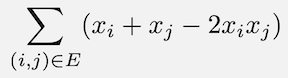
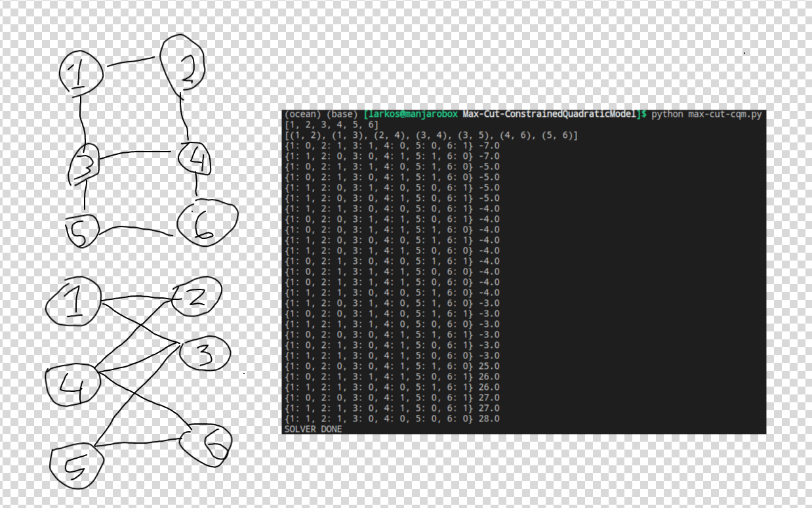

# Max-Cut-ConstrainedQuadraticModel

For a graph, a maximum cut is a cut whose size is at least the size of any other cut. 
That is, it is a partition of the graph's vertices into two complementary sets S and T, 
such that the number of edges between S and T is as large as possible. Finding such a cut is known as the max-cut problem.

The problem can be stated simply as follows. One wants a subset S of the vertex set 
such that the number of edges between S and the complementary subset is as large as 
possible. Equivalently, one wants a bipartite subgraph of the graph with as many edges as possible. 
## Usage

To run the demo, type:

```bash
python max-cut-cqm.py
```

After running, output will be printed to the command line that states how 
the nodes should be seperated(x[i] = 0 if it belongs to Subnet0 and x[i] = 1 otherwise)

## Code Overview

The code implements a QUBO formulation of this problem.

The answer that we are looking for is a partition of the nodes in the graph, so
we will assign a binary variable for each node, i.e. variable `x_i` denotes
whether node `i` is in one subset (call it Subset 0) or the other (Subset 1).

The objective function that we want should minimize the number of cut edges. To
count how many cut edges we have given a partition of the nodes (assignment of
our binary variables), we start with a single edge.  The table below shows how
we count the cut edges for a given graph partition (assignment of values to our
binary variables). Columns `x_i` and `x_j` are two nodes; column edge (i, j)
represents an edge between these two nodes.  We only want to count an edge if
the endpoints are in different subsets, and so we assign a 1 for the edge column
in this case and a 0 otherwise.

| x_i | x_j | edge (i,j) |
| :---: | :---: | :---: |
| 0 | 0 | 0 |
| 0 | 1 | 1 |
| 1 | 0 | 1 |
| 1 | 1 | 0 |

From this table, we see that we can use the expression `x_i+x_j-2x_ix_j`
to calculate the edge column in our table.  Now for our entire graph, our
objective function can be written as shown below, where the sum is over all
edges in the graph, denoted by E.



## Example
